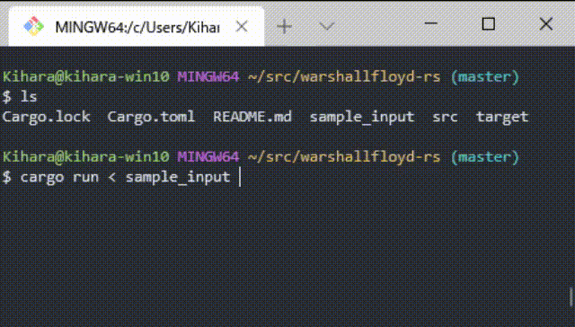

# Warshall-Floyd

[ワーシャル–フロイド法](https://ja.wikipedia.org/wiki/%E3%83%AF%E3%83%BC%E3%82%B7%E3%83%A3%E3%83%AB%E2%80%93%E3%83%95%E3%83%AD%E3%82%A4%E3%83%89%E6%B3%95) で値が更新される様子をアニメーションで出力します。

## 入力

有向グラフ G = (N, E) について頂点 i と頂点 j の辺の長さ l_ij を以下の形式で与えます

```
l_00 l_01 ... l_0N
l_01 l_11 ... l_1N
...
l_0N l_1N ... l_NN
```

# 出力

頂点 i から 頂点 j への最短経路 d_ij がワーシャル-フロイド法によって更新される様子が出力されます。



- 青: 現在走査中の要素
- 緑: 更新されなかった
- 赤: 更新された
